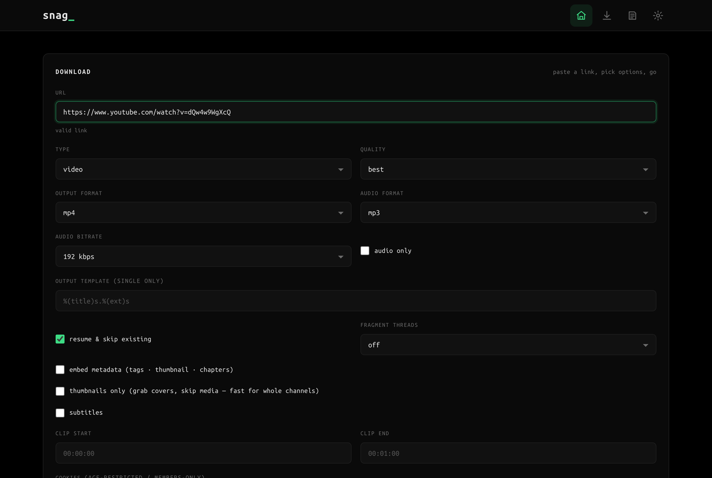

# Snag

**A minimal, self-hosted web UI for [yt-dlp](https://github.com/yt-dlp/yt-dlp) — paste a link, pick your options, and watch it download with live progress. Plus an AI Summarize tool that turns any video, playlist, or channel into a written article.**

[](https://github.com/drbiobit/snag/actions/workflows/pages.yml)
[](https://ghcr.io/drbiobit/snag)
[](LICENSE)
[](https://www.python.org/)
[](#quickstart)



## Why Snag?

- **No CLI, no build step.** The whole backend is one Python file and the
  frontend is plain HTML/CSS/JS — read it in ten minutes, hack on it today.
- **Up in 30 seconds.** A prebuilt Docker image is published on every push;
  one `docker run` and you're downloading.
- **Self-hosted and private.** Your downloads never touch a third-party
  server. Runs on a VPS, a home server, or your laptop.
- **Bulk-friendly.** Single videos, whole playlists, channels, or user
  profiles in one go — resumable, cancelable, up to 2 concurrent.
- **AI Summarize.** Point it at a video, playlist, or channel and get a clean
  Markdown article written by any OpenAI-compatible endpoint you configure.
  No data leaves your box except the transcript you send to your own API.

## Quickstart

### Docker (fastest, no prerequisites)

```bash
docker run -d --name snag \
  -p 8000:8000 \
  -v ./downloads:/data \
  ghcr.io/drbiobit/snag:latest

```

Open http://localhost:8000. On first visit you'll be asked to **create an
account** (or set `SNAG_USER` / `SNAG_PASSWORD` to skip it — see
[Authentication](#authentication)).

> **Upgrading from an older image?** Pull the latest image and recreate the
> container — your volume is untouched, so downloads and your account persist:
>
> ```bash
> docker pull ghcr.io/drbiobit/snag:latest
> docker rm -f snag          # stop + remove the old container (volume kept)
> docker run -d --name snag -p 8000:8000 -v ./downloads:/data ghcr.io/drbiobit/snag:latest
> ```
>
> Recent images fixed a bug where auth data (`users.json`) was lost on every
> container restart, making the app re-prompt for account setup. If you were
> hit by that, your account may need to be re-created once after upgrading —
> downloads in the volume are unaffected.

### From source

Requires Python 3.10+, [yt-dlp](https://github.com/yt-dlp/yt-dlp), and
[ffmpeg](https://ffmpeg.org/) on your `PATH`.

```bash
pip install -r requirements.txt
python snag.py
```

Open http://localhost:6909 (override with the `PORT` env var).

## Features

- 🎬 **Single videos** — best / 1080p / 720p / 480p
- 📦 **Bulk downloads** — entire playlists, channels or user profiles in one go
- 🎵 **Audio extraction** — MP3, M4A, WAV, OGG, FLAC with selectable bitrate
- 🗂 **Output formats** — mp4 / webm / mkv / mov for video, 5 audio codecs
- 📝 **Metadata embedding** — opt-in tags, thumbnails & chapters per download
- ⏯ **Resume** — interruptible downloads that skip files already on disk
- 🧵 **Multithreaded fragments** — parallel DASH/HLS fragment downloads
- ✏️ **Output templating** — custom `%(title)s`-style naming for single downloads
- ⚡ Real-time progress, up to 2 concurrent downloads, cancel anytime
- 🧠 **AI Summarize** — 3-step pipeline (transcript → AI article → Markdown)
  for single videos, playlists, or whole channels; works with any
  OpenAI-compatible endpoint (OpenAI, Groq, Ollama, LM Studio, …)

## Installation

| Method | Prerequisites | Command | Best for |
|---|---|---|---|
| **Docker** | Docker | `docker run … ghcr.io/drbiobit/snag:latest` | Quick launch, servers |
| **Docker Compose** | Docker | `docker compose up -d` (see [`docker/`](docker/)) | Persistent setup with env vars |
| **systemd** | Python 3, ffmpeg, yt-dlp | `sudo ./deploy-with-systemd.sh` | A Linux VPS you own (recommended) |
| **PM2** | Node.js, Python 3 | `./deploy-with-pm2.sh` | A server without Docker/systemd |
| **Mac / Windows** | Python 3, ffmpeg, yt-dlp | `./deploy-for-win-mac.sh` | Local use on your own machine |
| **From source** | Python 3, ffmpeg, yt-dlp | `python snag.py` | Development / tinkerers |

Full step-by-step instructions for every method (plus HTTPS and
troubleshooting) live in the [Deployment guide](https://drbiobit.github.io/snag/deployment).

## Usage

**Single video, 1080p MP4:**

```
paste the video URL → format: 1080 → output: mp4 → download
```

**Whole playlist as MP3 (320 kbps):**

```
paste the playlist URL → type: bulk → audio: mp3 @ 320k → download
```

**Channel archive with metadata embedded:**

```
paste the channel URL → type: bulk → embed metadata: on → download
```

Every option maps to a documented yt-dlp flag — see the
[yt-dlp Flags Reference](https://drbiobit.github.io/snag/yt-dlp-flags).

**Summarize a video into an article:**

```
Summarize tab → paste the video (or playlist/channel) URL →
Fetch transcript → Summarize → copy or download the Markdown
```

Configure the AI endpoint, model, and system prompt once in **Settings**
(⚙️) — see the [AI Summarize guide](https://drbiobit.github.io/snag/ai-summarize).

## Snag vs. the alternatives

| | **Snag** | **yt-dlp (CLI)** | **cobalt** |
|---|---|---|---|
| Interface | Web UI | Terminal | Web UI |
| Setup | 1 `docker run` | `pip install yt-dlp` | Self-host or use a public instance |
| Bulk (playlists/channels) | ✅ | ✅ | Limited |
| Audio extraction | ✅ 5 codecs | ✅ | ✅ |
| Full flag coverage | ✅ (documented) | ✅ all | ❌ opinionated |
| Self-hosted / private | ✅ | ✅ | ✅ |

**Use yt-dlp directly** if you live in the terminal and want every flag.
**Use Snag** if you want that same power in a browser with zero CLI.
**Use cobalt** if you want a minimal, opinionated UI and don't need bulk or
fine-grained options.

## Documentation

Full docs are published on GitHub Pages → **[drbiobit.github.io/snag](https://drbiobit.github.io/snag/)**

- [Deployment Guide](https://drbiobit.github.io/snag/deployment) — Docker, systemd, PM2, Mac/Windows, HTTPS
- [Docker Deep-Dive](https://drbiobit.github.io/snag/docker) — image internals, env vars, volumes, Compose, updates
- [AI Summarize](https://drbiobit.github.io/snag/ai-summarize) — setup, config, and the transcript → article pipeline
- [Configuration](https://drbiobit.github.io/snag/configuration) — every env var, the auth model, and the full HTTP API
- [Code Reference](https://drbiobit.github.io/snag/code-reference) — file-by-file walkthrough of `snag.py` + frontend
- [yt-dlp Flags Reference](https://drbiobit.github.io/snag/yt-dlp-flags) — every flag Snag exposes

## Authentication

The app supports two ways to set a password. Pick whichever fits your setup.

### Option A — create an account in the browser (no config)

Best for local use or when you don't want to touch any files.

1. Start the app (`python snag.py` or `docker compose up -d`).
2. Open http://localhost:6909 (or http://localhost:8000 for Docker).
3. You'll be redirected to a **"create account"** page.
4. Enter a username and password, confirm the password, click **create**.
5. You're logged in. From now on every visit requires sign-in.

The credentials are stored in `data/users.json` (on the `/data` volume in
Docker) and survive restarts and container rebuilds.

### Option B — set credentials via environment variables

Best for Docker / server deployments where you want fixed credentials set
once at deploy time.

**Local:**
```bash
SNAG_USER=admin SNAG_PASSWORD=your-strong-password python snag.py
```

**Docker Compose** — edit `docker/docker-compose.yml`:
```yaml
environment:
  SNAG_USER: admin
  SNAG_PASSWORD: your-strong-password
```

**Plain Docker:**
```bash
docker run -d --name snag -p 8000:8000 \
  -e SNAG_USER=admin -e SNAG_PASSWORD=your-strong-password \
  -v snag-data:/data snag
```

When both `SNAG_USER` and `SNAG_PASSWORD` are set, they **override** any
in-browser account — the setup page is skipped entirely.

### Resetting credentials

- **Option A:** delete `data/users.json` (or the `snag-data` volume) and
  reopen the app — the "create account" page appears again.
- **Option B:** unset the env vars, delete `data/users.json`, and restart.

### Security notes

- Passwords are hashed with **PBKDF2-SHA256** (200 000 iterations, random
  per-user salt). The plaintext is never stored.
- Sessions use signed Flask cookies (`HttpOnly`, `SameSite=Lax`, 7-day
  lifetime). The signing key is auto-generated on first start and persisted
  to `data/secret` so sessions survive restarts.
- `/health` is always open (no auth) so container healthchecks work.
- See `.env.example` for all available variables, and [SECURITY.md](SECURITY.md)
  for how to report a vulnerability.

## Project Layout

```
snag.py                     # Flask app + yt-dlp job runner + AI summarize API
frontend/index.html         # UI
frontend/login.html         # Login / first-setup page
frontend/summarize.html     # AI Summarize page (3-step pipeline)
frontend/app.js             # Frontend logic
frontend/ai-setup.js        # One-time AI endpoint setup popup
frontend/style.css          # Styles (pure-black terminal theme)
yt_summarize/
  yt-transcribe.py          # YouTube URL -> transcript Markdown
  summarize.py              # transcript + system prompt -> AI article
.env.example                # Environment variable reference
data/                       # SQLite DB: users, session key, AI settings (git-ignored)
downloads/                  # Output files
```

## API

| Endpoint | Method | Description |
|---|---|---|
| `/api/setup` | POST | first-run: create the initial account |
| `/api/login` | POST | `{username, password}` → start session |
| `/api/logout` | POST | end the current session |
| `/api/validate` | POST | `{url}` → validate YouTube URL + detect bulk |
| `/api/download` | POST | start a download → `{job_id}` |
| `/api/status/<job_id>` | GET | job progress/status |
| `/api/cancel/<job_id>` | POST | cancel a running job |
| `/api/downloads` | GET | list downloaded files |
| `/api/ai/settings` | GET/POST | read/update the AI endpoint, model, key, prompt & options |
| `/api/ai/setup-done` | POST | mark the one-time AI setup as complete |
| `/api/ai/models` | GET | list models from the configured endpoint |
| `/api/ai/transcript` | POST | `{url, count?, timestamps?, languages?}` → transcript Markdown (video/playlist/channel) |
| `/api/ai/summarize` | POST | `{transcript, temperature?, timeout?}` → AI-written article Markdown |

### Download request body

```json
{
  "url": "https://www.youtube.com/watch?v=...",
  "type": "video | bulk | mp3",
  "format": "best | 1080 | 720 | 480 | audio | video",
  "audio_only": false,
  "audio_format": "mp3",
  "audio_quality": 2,
  "output_format": "mp4",
  "output_template": "%(title)s.%(ext)s",
  "resume": true,
  "fragments": 4,
  "metadata": false
}
```

## Notes

- **Metadata** (tags, thumbnail, chapters) is only embedded when the "embed metadata" option is enabled.
- **Output templates** only apply to single downloads — bulk downloads always
  use the default per-file naming so each item in a collection is saved separately.
- **Multithreaded fragments** speed up DASH/HLS downloads; leave "off" for
  progressive (non-fragment) streams.

## Contributing

Contributions are welcome. The short version:

1. Read [CONTRIBUTING.md](CONTRIBUTING.md) for dev setup and the PR process.
2. Keep the backend a single file and the frontend build-step-free.
3. Run the app locally and verify your change before opening a PR.

Please also read our [Code of Conduct](CODE_OF_CONDUCT.md).

## License

[MIT](LICENSE) — see [LICENSE](LICENSE).
